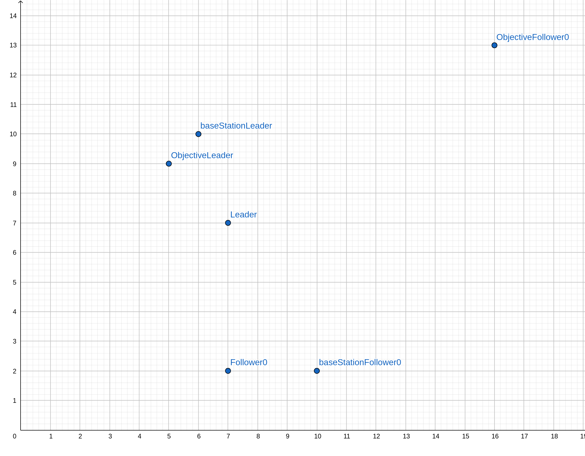
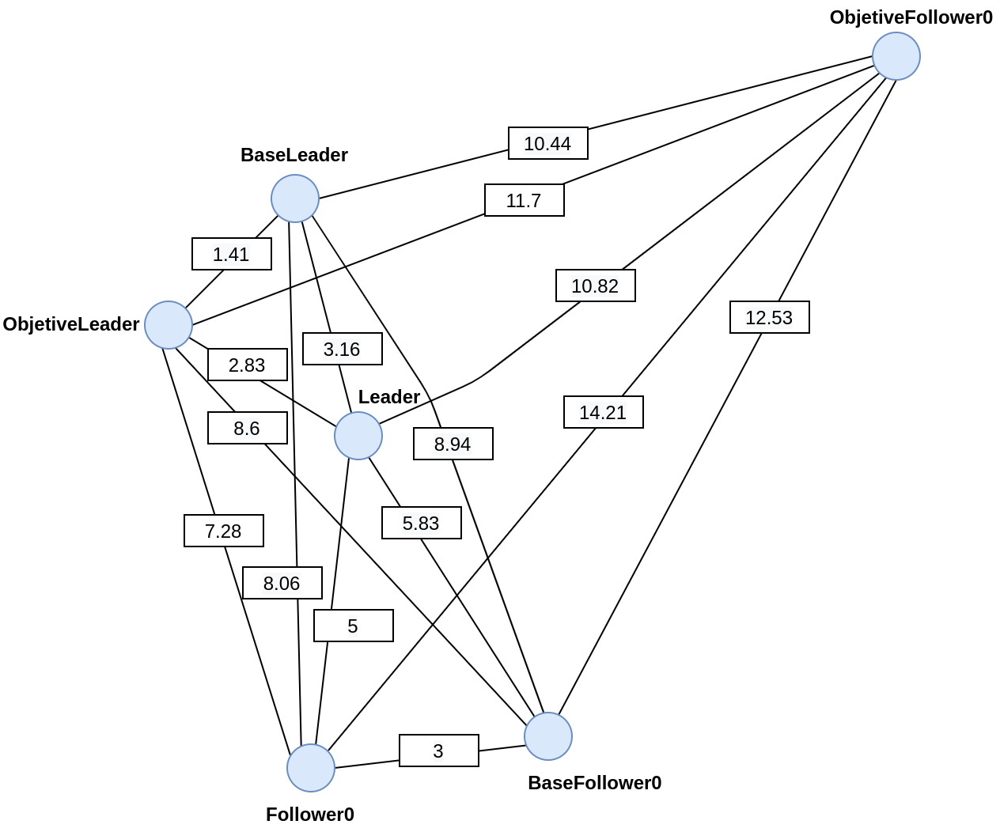

# Cooperation

## Coordenadas en el plano

<p align="center">
  
</p>

## Cálculo de distancias

Tras ejecutar el script **dist.py**.

```
$ python dist.py

base station Leader - base station Leader = 0.0
base station Leader - base station Follower0 = 8.94
base station Leader - objective Leader = 1.41
base station Leader - objective Follower0 = 10.44
base station Leader - init position Leader = 3.16
base station Leader - init position Follower0 = 8.06

base station Follower0 - base station Follower0 = 0.0
base station Follower0 - objective Leader = 8.6
base station Follower0 - objective Follower0 = 12.53
base station Follower0 - init position Leader = 5.83
base station Follower0 - init position Follower0 = 3.0

objective Leader - objective Leader = 0.0
objective Leader - objective Follower0 = 11.7
objective Leader - init position Leader = 2.83
objective Leader - init position Follower0 = 7.28

objective Follower0 - objective Follower0 = 0.0
objective Follower0 - init position Leader = 10.82
objective Follower0 - init position Follower0 = 14.21

init position Leader - init position Leader = 0.0
init position Leader - init position Follower0 = 5.0

init position Follower0 - init position Follower0 = 0.0
```

## Grafo completo de puntos

<p align="center">
  
</p>
